# 一、基础认知

目标：认识==网页组成==和==五大浏览器==，明确==Web标准的构成==，使用==HTML骨架==搭建出一个网页。

学习路径：

## 1. 基础概念铺垫（了解）

### 1. 认识网页

#### 1.1.1 认识网页（了解）

问题1：网页由哪些部分组成？
			  文字、图片、音频、视频、超链接

问题2：我们看到的网页背后本质是什么？
			  前端程序员写的代码

问题3：前端的代码是通过什么软件转换成用户眼中的页面的？
			  通过浏览器转化(解析和渲染)成用户看到的网页

### 2. 五大浏览器和渲染引擎

#### 1.2.1 五大浏览器

浏览器：是网页显示、运行的平台，是前端开发必备利器

常见的五大浏览器：

* ie浏览器、火狐浏览器(Firefox)、谷歌浏览器(Chrome)、Safari浏览器、欧朋浏览器(Opera)

#### 1.2.2 渲染引擎(了解)

渲染引擎(浏览器内核)：浏览器中专门对代码进行解析渲染的部分

浏览器出品的公司不同，内在的渲染引擎也是不同的：

<table>
    <tr>
        <td align="center" width="200">浏览器</td>
        <td align="center" width="200">内核</td>
        <td align="center" >备注</td>
    </tr>
    <tr>
        <td align="center">ie</td>
        <td align="center">Trident</td>
        <td align="center">IE、猎豹安全、360极速浏览器、百度浏览器</td>
    </tr>
    <tr>
        <td align="center">FireFox</td>
        <td align="center">Gecko</td>
        <td align="center">火狐浏览器内核</td>
    </tr>
    <tr>
        <td align="center">Safari</td>
        <td align="center">Webkit</td>
        <td align="center">苹果浏览器内核</td>
    </tr>
    <tr>
        <td align="center">Chrome/Opera</td>
        <td align="center">Blink</td>
        <td align="center">Blink其实是Webkit的分支</td>
    </tr>
</table>

注意点：

* 渲染引擎不同，导致解析相同代码时的速度、性能、效果也不同的
* 谷歌浏览器的渲染引擎速度快、性能高、效果好，所以更吸引用户的喜爱(推荐)

### 3. Web标准

#### 1.3.1 为什么需要Web标准？(了解)

不同浏览器的渲染引擎不同，对于相同代码解析的效果会存在差异

* 如果用户想看一个网页，结果用不同浏览器打开效果不同，用户体验极差！

Web标准：让不同的浏览器按照相同的标准显示结果，让展示的效果统一！
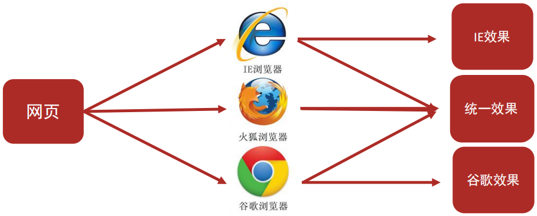

#### 1.3.2 Web标准的构成

Web标准中分成三个构成：
<table>
    <tr>
        <td align="center" width="200">构成</td>
        <td align="center" width="200">语言</td>
        <td align="center" >说明</td>
    </tr>
    <tr>
        <td align="center">结构</td>
        <td align="center">HTML</td>
        <td align="center">页面元素和内容</td>
    </tr>
    <tr>
        <td align="center">表现</td>
        <td align="center">CSS</td>
        <td align="center">网页元素的外观和位置等页面样式(如：颜色、大小等)</td>
    </tr>
    <tr>
        <td align="center">行为</td>
        <td align="center">JavaScript</td>
        <td align="center">网页模型的定义与页面交互</td>
    </tr>
</table>

	#### 1.3.3 Web标准的记忆方法

Web标准要求页面实现：结构、表现、行为三层分离
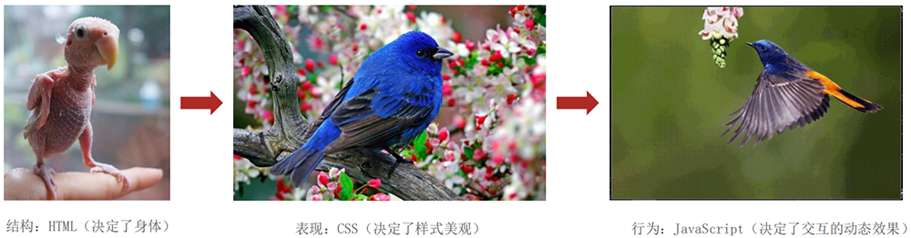

## 2. HTML初体验

### 1. HTML的感知

#### 2.1.1 HTML的概念

HTML(Hyper Text Markup Language)中文译为：超文本标记语言

* 专门用于网页开发的语言，主要通过==HTML标签==对网页中的文本、图片、音频、视频等内容进行描述

案例：文字变粗案例

* 体验构建一个网页，需要在网页中显示一个加粗的文字

#### 2.1.2 网页体验-构建基本网页的步骤

1. 在代码文件夹中点击鼠标右键--> 新建文本文档-->命名为：==文字变粗案例.txt==
2. 双击这个文件，输入代码等内容--->==记得保存!==
3. 在文件上点击鼠标右键-->重命名-->修改文件后缀名==.html==
4. 双击==文字变粗案例.html==，浏览器会自动打开文件并显示之前输入的内容

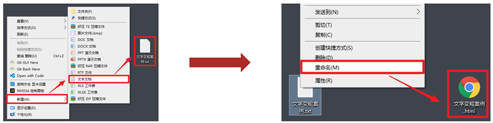

### 2. HTML骨架结构

#### 2.2.1 HTML页面固定结构

网页类似于一篇文章

* 每一页文章内容是由固定的结构的，如：开头、正文、落款等......
* 网页中也是存在固定的结构的，如：整体、头部、标题、主体

网页中的固定结构是通过特定的==HTML标签==进行描述的
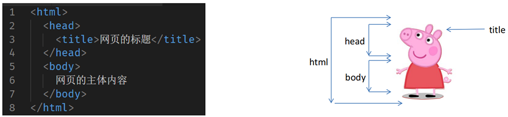

	### 3. 开发工具的使用

#### 2.3.1 为什么要使用VS Code?

刚刚通过文本编辑器，如：记事本，完全可以编写网页源代码

* 但是效率......不忍直视

实际开发中，注重开发的==效率和便捷性==，因此我们会使用一些开发工具

* 开发工具有很多：Visual Studio Code、Webstorm、Sublime、Dreamweaver、Hbuilder

前端开发神器：VS Code-->速度快、体积小、插件多

#### 2.3.2 VS Code使用前要求

1. VSCode软件安装完毕
2. Chinses(Simplified) Language Pack for Visual Studio Code 简体中文插件安装完毕
3. open in browser 直接打开浏览器插件安装完毕

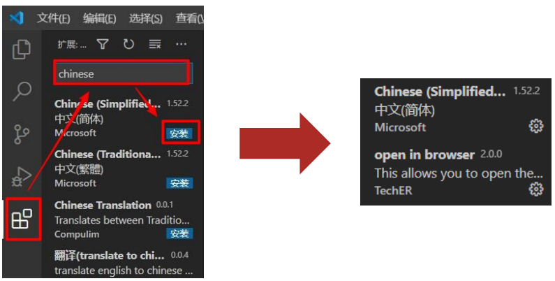

#### 2.3.3 VS Code创建网页的步骤

1. 双击打开VSCode 软件
2. 将==day01代码==文件夹用鼠标左键按住不放，拖拽到VS Code窗口中，文件夹会显示在左侧目录上
3. 点击目录上的==+新建文件按钮==创建页面，注意：==文件后缀名需要是.html==

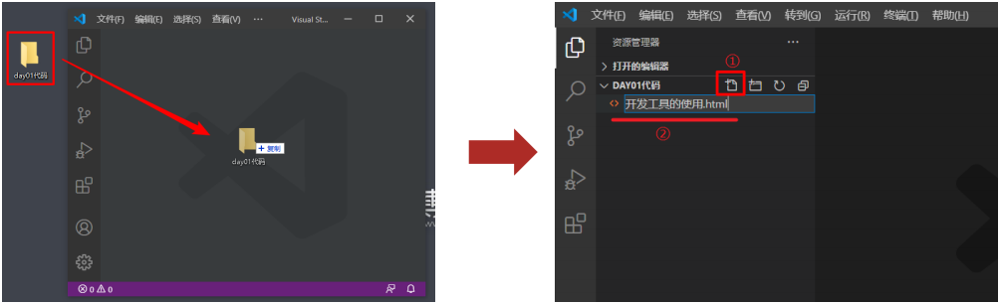

#### 2.3.4 VS Code的基本快捷键

1. 快速生成标签：英文 ! + tab
2. 保存文件：ctrl + s
   * 注意1：写完文件之后务必需要保存文件，否则网页无变化
   * 注意2：可以设置自动保存省去每次保存的麻烦
3. 快速查看网页效果：右击---> Open in Default Browser
   * 快捷键：alt + b
   * 注意：==必须安装了open in browser插件==
4. 快速生成结构标签：! + tab
   + 注意1：==!必须是英文的==，中文！无效
   + 注意2：==必须保证当前文件后缀名是.html==，否则无效
   + VS Code自动生成的骨架多了其他标签，之后会介绍

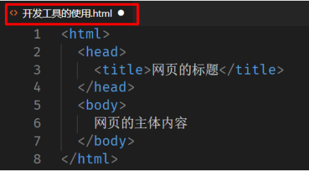 

#### 2.3.5 VS Code的其他快捷

1. 快速复制一整行：ctrl + c
2. 快速粘贴一整行：ctrl + v
3. 快速删除(剪切)一整行：ctrl + x

​	......
​	其他快捷键会在学习过程中用到一个介绍一个！

## 3. 语法规范

### 1. HTML的注释

#### 3.1.1 什么是注释？

在之前上课时，同学们会在书本段落间记录内容的注解，方便下次看到此处理解

* 问题：同学们在书本段落间记录下的注解是为了给谁看的？
* 下次的阅读课本者(自己)

程序员在写代码时也会添加注释，方便下次看到此处时方便想起功能和含义

* 问题：程序员在代码中添加的注释，是为了给谁看的？
* 下次的阅读代码者(自己或者其他程序员)

#### 3.1.2 注释的作用和写法

注释的作用：

* 为代码添加的具有解释性、描述性的信息，主要用来==帮助开发人员理解代码==
* ==浏览器执行代码时会忽略所有的注释==

注释的快捷键：

* 在VS Code中：ctrl + /

### 2. HTML标签的构成

#### 3.2.1 HTML标签的结构

标签的结构图：

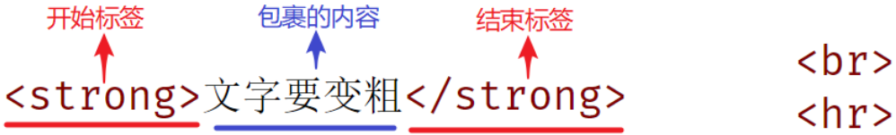

结构说明：

1. 标签由<、>、/、英文单词或字母组成。并且把标签中<>包括起来的英文单词或字母称为==标签名==
2. 常见标签由两部分组成，我们称之为：==双标签==。前部分交==开始标签==，后部分叫==结束标签==,两部分之间包裹内容
3. 少数标签由一部分组成，我们称之为：==单标签==。自成一体，无法包裹内容。

### 3. HTML标签的关系

#### 3.3.1 HTML标签与标签之间的关系可分为：

父子关系(嵌套关系)

&lt;head&gt;
	 &lt;title&gt;&lt;/title&gt;
&lt;/head&gt;

兄弟关系(并列关系)
 &lt;head&gt;&lt;/head&gt;
 &lt;body&gt;&lt;/body&gt;

# 二、HTML标签学习

目标：学习HTML  ==排版、媒体、链接== 等基础标签，完成 ==基础网页== 的开发

学习路径：

## 1. 排版标签

### 1. 标题标签

#### 1.1.1 标题标签

场景：在新闻和文章的页面中，都离不开==标题==，用来突出显示文章主题

代码：h系列标签

&lt;h1&gt;1级标题&lt;/h1&gt;
&lt;h2&gt;2级标题&lt;/h2&gt;
&lt;h3&gt;3级标题&lt;/h3&gt;
&lt;h4&gt;4级标题&lt;/h4&gt;
&lt;h5&gt;5级标题&lt;/h5&gt;
&lt;h6&gt;6级标题&lt;h6&gt;

语义： 1~6级标题，重要程度依次递减

特点：

1. 文字都有加粗
2. 文字都有变大，并且从h1-->h6文件逐渐减小
3. 独占一行

注意点：h1标签对于网页尤为重要，开发中有特定的使用场景，如：新闻的标题、网页的logo部分

### 2. 段落标签

#### 1.2.1 段落标签

场景：在新闻和文章的页面中，用于分段显示

代码：==&lt;p&gt;==我是一段文字==&lt;/p&gt;==

语义：段落

特点：

* 段落之间存在间隙
* 独占一行

### 3. 换行标签

#### 1.3.1 换行标签

场景：让文字强制换行显示

代码：==&lt;br&gt;==

语义：换行

特点：

* 单标签
* 让文字强制换行

### 4. 水平线标签

#### 1.4.1 水平线标签

场景：分割不同主题内容的水平线

代码：==&lt;hr&gt;==

语义：主题的分割转换

特点：

* 单标签
* 在页面中显示一条水平线

## 2.文本格式化标签

### 2.1 文本格式化标签的介绍

场景：需要让文字<strong>加粗</strong>、<ins>下划线</ins>、<em>倾斜</em>、<del>删除线</del>等效果

代码：

| 标签 |  说明  |      |  标签  |  说明  |
| :--: | :----: | ---- | :----: | :----: |
|  b   |  加粗  |      | strong |  加粗  |
|  u   | 下划线 |      |  ins   | 下划线 |
|  i   |  倾斜  |      |   em   |  倾斜  |
|  s   | 删除线 |      |  del   | 删除线 |

语义：突出重要性的强调语境

### 2.2 标签语义化(了解)

实际项目开发中选择标签的原则：标签语义化

* 即：根据语义选择对应正确的标签
* 如：需要些标题，就使用h系列标签
* 如：需要些段落，就使用p标签
* ......

好处：

* <b>对人</b>：好理解，好记忆
* <b>对机器</b>：有利于机器解析，对搜索引擎(SEO)有帮助

推荐：

* strong、ins、em、del，表示的强调语义更强烈！

## 3. 媒体标签

### 1. 图片标签

#### 3.1.1 图片标签的介绍

➢ 场景：在网页中显示图片
➢ 代码：&lt;img     src=" "   alt=" "&gt;
➢ 特点：

* 单标签
* img标签需要展示对应的效果，需要借助标签的属性进行设置！

➢ 标签的完整结构图：
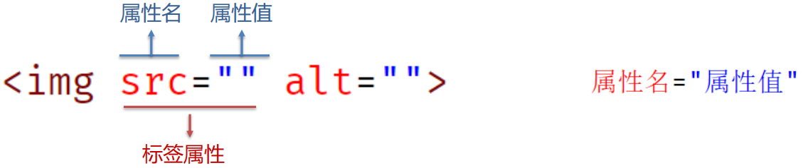

➢ 属性注意点：

1. 标签的属性写在==开始标签内部==
2. 标签上可以同时存在多个属性
3. 属性之间以空格隔开
4. 标签名与属性之间==必须以空格隔开==
5. 属性之间没有顺序之分

#### 3.1.2 图片标签的src属性

➢ 属性名：src

➢ 属性值：目标图片的路径

➢ 注意点：

* 当前网页和目标图片在同一个文件夹中，路径直接写目标图片的名字即可(包括后缀名)
* 路径的情况有很多，稍后会详细介绍

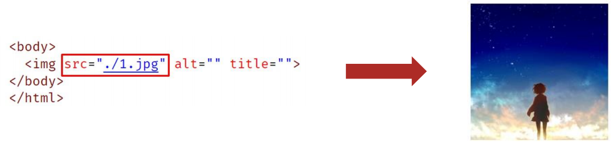

#### 3.1.3 图片标签的alt属性

➢ 属性名：alt

➢ 属性值：替换文本

* 当图片加载失败时，才显示alt的文本
* 当图片加载成功时，不会显示alt的文本

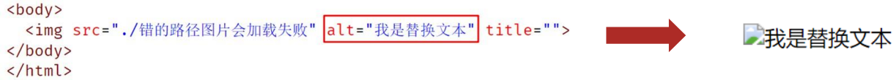

#### 3.1.4 图片标签的title属性

➢ 属性名：title

➢ 属性值：提示文本

* 当鼠标悬停时，才显示的文本

➢ 注意点：title属性不仅仅可以用于图片标签，还可以用于其他标签
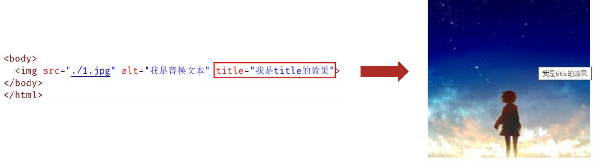

#### 3.1.5 图片标签的width 和height属性

➢ 属性名：width 和 height

➢ 属性值：宽度和高度(数字)

➢ 注意点：

* 如果只设置width和height中的一个，另一个没设置的会自动等比例缩放(此时图片不会变形)
* 如果同时设置了width和height两个，若设置不当此时图片可能会变形

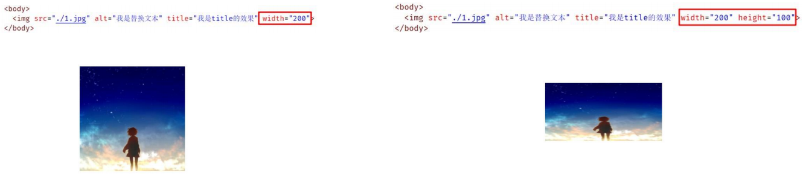

#### 3.1.6 图片标签小结

➢ 在页面中展示一张图片，需要使用说明标签？

* img标签

➢ 图片的常见属性有哪些？

|  属性  |                   说明                   |
| :----: | :--------------------------------------: |
|  src   |          指定需要展示图片的路径          |
|  alt   | 替换文本，当图片加载失败时，才显示的文字 |
| title  |   提示文字，当鼠标悬停时，才显示的文字   |
| width  |                图片的宽度                |
| height |                图片的高度                |

### 2. 路径

#### 3.2.1 路径的介绍

➢ 场景：页面需要加载图片，需要线找到对应的图片

➢ 类似于：生活中两个人，我要去找你，需要通过一定的路径才能找到！

➢ 同理：页面需要找到图片，也是需要通过路径才能找到

➢ 路径可分为：

* 绝对路径（了解）
* 相对路径（常用）

#### **3.2.2** **绝对路径（了解）**

➢ 绝对路径：指目录下的绝对位置，可直接到达目标位置，通常**从盘符开始**的路径

➢ 例如：

* 盘符开头：D:\day01\images\1.jpg
* 完整的网络地址：https://www.itcast.cn/2018czgw/images/logo.gif（了解）

#### **3.2.3** **相对路径（常用）**

➢ 概念普及：

* 当前文件：当前的html网页
* 目标文件：要找到的图片

➢ 相对路径：从==当前文件开始==出发找目标文件的过程

➢ 相对路径分类：

* 同级目录
* 下级目录
* 上级目录

#### **3.2.4** 相对路径-同级目录

➢ 同级目录：当前文件和目标文件在同一目录中
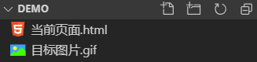

➢ 类似于：我（当前文件）和你（目标文件）都在大厅（一个文件夹中）

* 生活中：两个人独处一室，我想找你，直接喊名字即可！

➢ 代码步骤：直接写目标文件的名字即可

* 方法一：&lt;img src="目标图片.gif">
* 方法二：&lt;img src="./目标图片.gif">

➢ ==VS Code快捷操作==：直接敲./后，会自动提示同级目录中有哪些文件，直接选择即可！

#### **3.2.5** 相对路径-下级目录

➢ 下级目录：目标文件在下级目录中
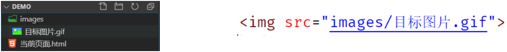

➢ 类似于：我在大厅，你累了去卧室休息了，我现在要找到你！

1. 先知道你去了哪一个房间 → 房间名：卧室
2. 进入这个房间 → 进入
3. 此时又独处一室 → 直接喊你名字

➢ 代码步骤：

1. 先知道在哪个文件夹里面 → 文件夹名字
2. 进入这个文件夹 → /
3. 此时看到目标文件直接喊她 → 直接写目标文件名字

➢ ==VS Code快捷操作==：直接敲./后，会自动提示当前目录下有哪些文件夹，直接一层层选择即可！

#### **3.2.6** 相对路径-上级目录

➢ 上级目录：目标文件在上级目录中
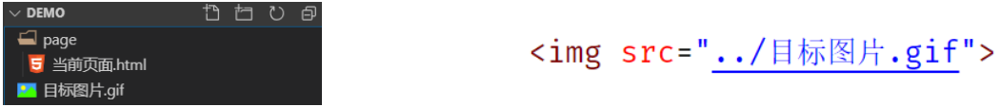

➢ 类似于：乾坤大挪移，我在卧室，你还在大厅，我现在要找到你！

1. 先要出卧室，来到大厅 → 出去
2. 此时又独处一室 → 直接喊你名字

➢ 代码步骤：

1. 先出当前文件夹，到上一级目录 → ../
2. 此时看到目标文件直接喊她 → 直接写目标文件

➢ ==VS Code快捷操作==：直接敲../后，会自动提示上级目录下有文件，直接选择即可！

#### 3.2.7 路径小结

➢ 相对路径有哪三种情况：

* 同级目录：直接写：目标文件名字！
* 下级目录：直接写：文件夹名/目标文件名字！
* 上级目录：直接下：../目标文件名字！

➢ VSCode中路径的快捷操作？

* 同级和下级目录：./ 之后选择即可
* 上级目录：../ 之后选择即可

### 3. 音频标签

#### **3.3.1** 音频标签的介绍

➢ 场景：在页面中插入音频

➢ 代码：&lt;audio src="./music.mp3"  controls&gt;&lt;/audio&gt;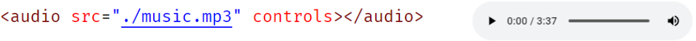

➢ 常见属性：

|  属性名  |            功能            |
| :------: | :------------------------: |
|   src    |         音频的路径         |
| controls |       显示播放的控件       |
| autoplay | 自动播放(部分浏览器不支持) |
|   loop   |          循环播放          |

➢ 注意点：

* 音频标签目前支持三种格式：==MP3==、Wav、Ogg

### 4.视频标签

#### **3.4.1** 视频标签的介绍

➢ 场景：在页面中插入视频
➢ 代码：&lt;video src="./video.mp4" controls>&lt;/video&gt;
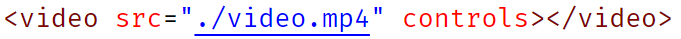

➢ 常见属性：

|  属性名  |            功能            |
| :------: | :------------------------: |
|   src    |         音频的路径         |
| controls |       显示播放的控件       |
| autoplay | 自动播放(部分浏览器不支持) |
|   loop   |          循环播放          |

➢ 注意点：

*  

  视频标签目前支持三种格式：==MP4== 、WebM 、Ogg

## 4. 链接标签

### **4.1** 链接标签的介绍

➢ 场景：点击之后，从一个页面跳转到另一个页面
➢ 称呼： a标签、超链接、锚链接
➢ 代码：&lt;a href="./目标网页.html"&gt;超链接&lt;/a&gt;

➢ 特点：

* 双标签，内部可以包裹内容
* 如果需要a标签点击之后去指定页面，需要设置a标签的href属性

### **4.2** 链接标签的href属性

➢ 属性名：href
➢ 属性值：点击之后跳转去哪一个网页（目标网页的路径） 

* 外部链接：&lt;a href="https://www.baidu.com/"&gt;百度一下&lt;/a&gt;
* 内部链接：&lt;a href="./目标网页.html"&gt;目标网页&lt;/a&gt;

### **4.3** 链接标签的显示特点（了解）

➢ 显示特点：

* a标签默认文字有下划线
* a标签从未点击过，默认文字显示蓝色
* a标签点击过之后，文字显示为紫色（清除浏览器历史记录可恢复蓝色）

### **4.4** 链接标签的target属性

➢ 属性名：target
➢ 属性值：目标网页的打开形式

|  取值  |                 效果                 |
| :----: | :----------------------------------: |
| _self  | 默认值，在当前窗口中跳转(覆盖原网页) |
| _blank |      在新窗口中跳转(保留原网页)      |

### **4.5** 链接标签小结

➢ 如果需要实现点击之后，从一个页面跳转到另一个页面，需要使用什么标签？

* 链接标签：a标签

➢ 通过什么属性可以设置a标签的到底跳转去哪里？

* href属性

➢ 通过什么属性可以设置a标签的跳转方式？取值有哪些？

* target属性
* 取值1：_self：在当前窗口中跳转
* 取值2：_blank：在新窗口中跳转

### **4.6** 空链接（拓展补充）

➢ 代码：&lt;a href="#"&gt;空连接&lt;/a&gt;
➢ 功能：

* 点击之后回到网页顶部
* 开发中不确定该链接最终跳转位置，用空链接占个位置

## 5. 综合案例

### 5.1 招聘案例--效果图

#### 5.1.2 招聘案例--文本资料

腾讯科技高级web前端开发岗位

职位描述

负责重点项目的前端技术方案和架构的研发和维护工作；

岗位要求

5年以上前端开发经验， 精通html5/css3/javascript等 web开发技术；

熟悉bootstrap，vue，angularjs，reactjs等框架，熟练掌握一种以上；

代码⻛格严谨，能⾼保真还原设计稿，能兼容各种浏览器； 

对web前端的性能优化以及web常见漏洞有一定的理解和相关实践；

具备良好的分析解决问题能力，能独立承担任务，有开发进度把控能力；

责任心强，思路路清晰，抗压能力好，具备良好的对外沟通和团队协作能力。

工作地址

上海市-徐汇区-腾云大厦

### 5.2 今日热词案例--效果图

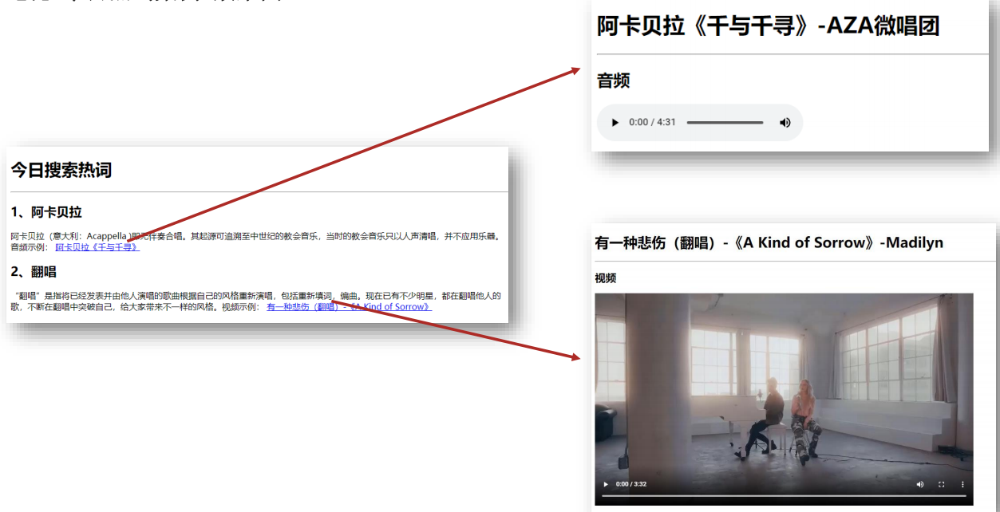

#### 5.2.2 今日热词案例--文字资料

今日搜索热词

1、阿卡贝拉

阿卡贝拉（意大利：Acappella )即无伴奏合唱。其起源可追溯至中世纪的教会音乐，当时的教会音乐只以人声清唱，并不应用乐器。音频示例：阿卡贝拉《千与千寻》 

2、翻唱

“翻唱”是指将已经发表并由他人演唱的歌曲根据自己的风格重新演唱，包括重新填词，编曲。现在已有不少明星，都在翻唱他人的歌，不断在翻唱中突破自己，给大家带

来不一样的风格。视频示例： 有一种悲伤（翻唱）-《A Kind of Sorrow》

阿卡贝拉《千与千寻》-AZA微唱团

音频

有一种悲伤（翻唱）-《A Kind of Sorrow》-Madilyn

视频

## 6. 标签总结

目标：学习HTML ==排版、媒体、链接== 等基础标签，完成==基础网页== 的开发

1. 排版标签：
   *  标题h系列、段落p、换行br、水平线hr
2. 文本格式化标签：
   * 加粗strong、下划线ins、倾斜em、删除线del
3. 图片标签：
   * img标签 + src属性 + alt属性 + title属性 + width属性 + height属性
4. 路径：
   * 相对路径：同级目录 + 下级目录 + 上级目录
5. 音频标签、视频标签：
   * audio标签、 video标签 + src属性 + controls属性
6. 链接标签：
   * a标签 + href属性 + target属性

目标确认
◆ 能够理解HTML的 ==基本语法== 和标签的关系
◆ 能够使用 ==排版标签== 实现网页中标题、段落等效果
◆ 能够使用 ==相对路径== 选择不同目录下的文件
◆ 能够使用== 媒体标签== 在网页中显示图片、播放音频和视频
◆ 能够使用 ==链接标签== 实现页面跳转功能